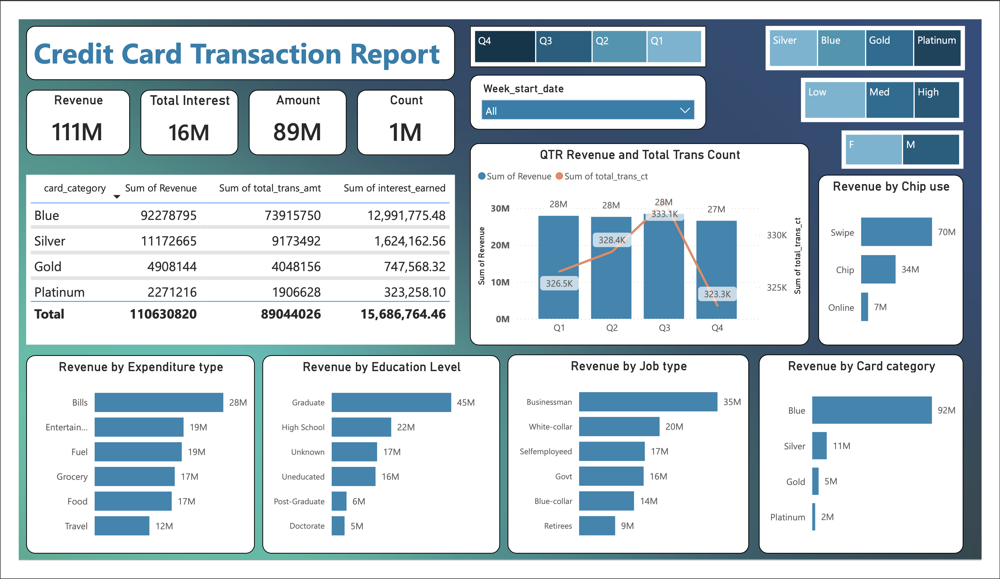
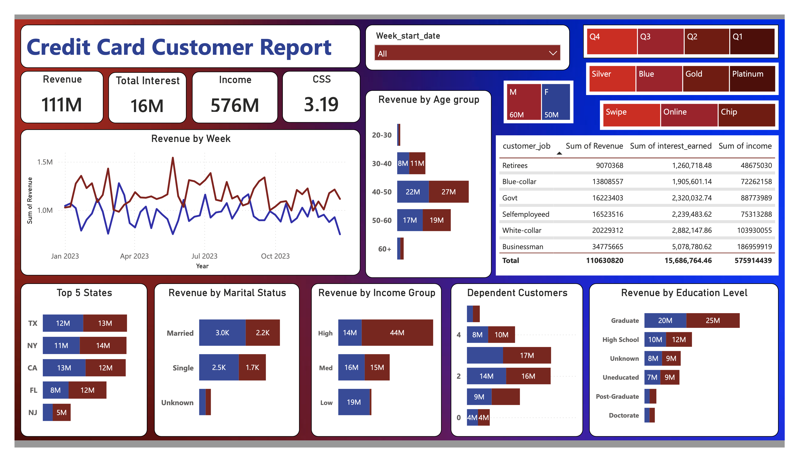

# Credit_Card_Dashboards

<div align="center">


# 💳 Credit Card Financial Dashboard

### SQL • PostgreSQL • Power BI • DAX • Business Intelligence


<p>


</p>

</div>

---

# 📌 About the Project

This project demonstrates an end-to-end Business Intelligence solution built using **PostgreSQL**, **Power BI**, and **DAX**.

The dashboard transforms raw credit card customer and transaction datasets into meaningful business insights through interactive visualizations and KPI reporting.

---

# 📊 Dashboard Preview

## 💳 Transaction Dashboard

<p align="center">



</p>

---

## 👤 Customer Dashboard

<p align="center">



</p>

---

## 📈 Weekly Status Report

<p align="center">


</p>

---

# 🚀 Project Architecture

```text
                 CSV Files
        customer.csv
        cc_detail.csv
               │
               ▼
        PostgreSQL Database
               │
               ▼
      Power BI Data Connection
               │
               ▼
       Data Cleaning & Modeling
               │
               ▼
         DAX Calculations
               │
               ▼
      Interactive Dashboards
               │
               ▼
      Weekly Business Insights
```

---

# 🛠 Tech Stack

| Tool | Purpose |
|------|---------|
| PostgreSQL | Data Storage |
| SQL | Data Import |
| Power BI | Dashboard |
| DAX | Calculations |
| Excel / CSV | Dataset |

---

# 📂 Project Workflow

## Step 1 — Prepare CSV Files

```
customer.csv

credit_card.csv
```

---

## Step 2 — Create SQL Tables

```sql
CREATE TABLE cust_detail (...);

CREATE TABLE cc_detail (...);
```

---

## Step 3 — Import CSV into PostgreSQL

```sql
COPY cust_detail
FROM 'customer.csv'
DELIMITER ','
CSV HEADER;

COPY cc_detail
FROM 'credit_card.csv'
DELIMITER ','
CSV HEADER;
```

---

## Step 4 — Connect PostgreSQL to Power BI

```
Power BI

↓

Get Data

↓

PostgreSQL

↓

Load Tables
```

---

## Step 5 — Data Cleaning

✔ Remove Null Values

✔ Correct Data Types

✔ Rename Columns

✔ Validate Data

---

## Step 6 — Data Modeling

✔ Relationships

✔ Star Schema

✔ Calendar Table

✔ Measures

---

## Step 7 — Create DAX Measures

<details>

<summary>Age Group</summary>

```DAX
AgeGroup =
SWITCH(
TRUE(),
'public cust_detail'[customer_age] < 30, "20-30",
'public cust_detail'[customer_age] >=30 &&
'public cust_detail'[customer_age] <40,"30-40",
'public cust_detail'[customer_age] >=40 &&
'public cust_detail'[customer_age] <50,"40-50",
'public cust_detail'[customer_age] >=50 &&
'public cust_detail'[customer_age] <60,"50-60",
'public cust_detail'[customer_age] >=60,"60+",
"Unknown"
)
```

</details>

<details>

<summary>Income Group</summary>

```DAX
IncomeGroup =
SWITCH(
TRUE(),
'public cust_detail'[income] <35000,"Low",
'public cust_detail'[income] >=35000 &&
'public cust_detail'[income] <70000,"Med",
'public cust_detail'[income] >=70000,"High",
"Unknown"
)
```

</details>

<details>

<summary>Revenue</summary>

```DAX
Revenue =
'public cc_detail'[annual_fees]
+
'public cc_detail'[total_trans_amt]
+
'public cc_detail'[interest_earned]
```

</details>

<details>

<summary>Week Number</summary>

```DAX
week_num2 =
WEEKNUM(
'public cc_detail'[week_start_date]
)
```

</details>

<details>

<summary>Current Week Revenue</summary>

```DAX
Current_week_Revenue =
CALCULATE(
SUM('public cc_detail'[Revenue]),
FILTER(
ALL('public cc_detail'),
'public cc_detail'[week_num2]
=
MAX('public cc_detail'[week_num2])
))
```

</details>

<details>

<summary>Previous Week Revenue</summary>

```DAX
Previous_week_Revenue =
CALCULATE(
SUM('public cc_detail'[Revenue]),
FILTER(
ALL('public cc_detail'),
'public cc_detail'[week_num2]
=
MAX('public cc_detail'[week_num2])-1
))
```

</details>

---

# 📈 Dashboard Highlights

- Revenue Analysis
- Customer Segmentation
- Spending Categories
- Revenue by State
- Revenue by Age Group
- Card Category Analysis
- Education Analysis
- Income Analysis
- Weekly Revenue Trend
- Customer Demographics

---

# 📊 Business Insights

| KPI | Value |
|------|------:|
| Revenue | **111M** |
| Interest Earned | **16M** |
| Customer Income | **576M** |
| Transactions | **1M+** |

### Key Findings

- Blue credit cards generate the highest revenue.
- Businessman customers contribute the largest share of revenue.
- Texas, New York, and California are the top-performing states.
- Swipe transactions dominate overall transaction volume.
- Revenue is highest among customers aged 40–60 years.

---

# 📁 Repository Structure

```text
Credit-Card-Financial-Dashboard
│
├── Dashboard
│   └── Credit Card Dashboard.pbix
│
├── Dataset
│
├── SQL
│
├── DAX
│
├── Images
│   ├── customer-dashboard.png
│   ├── transaction-dashboard.png
│   └── weekly-status-report.png
│
├── README.md
│
└── LICENSE
```

---

# ⭐ Future Enhancements

- Real-time database integration
- Automated weekly report refresh
- Power BI Service deployment
- KPI alert notifications
- Predictive analytics using Python

---

<div align="center">

### ⭐ If you found this project useful, don't forget to Star the repository!

Made with ❤️ by **Keyur Shelke**

</div>

